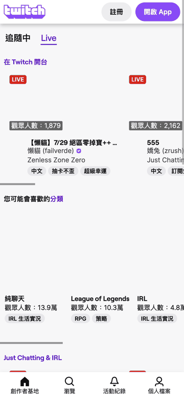

## Setup

```bash
cd OpenNet
python3 -m venv .venv
source .venv/bin/activate        # Windows: .venv\Scripts\activate
pip install -r requirements.txt
```

## Running the tests

```bash
pytest
```

Run a single test with the browser visible:

```bash
pytest tests/test_streamer_search.py -v
```

## Demo



Frames captured from an actual local run: Twitch home → search opened →
"StarCraft II" typed → category page → scrolled twice → streamer selected →
streamer page loaded and screenshotted.
